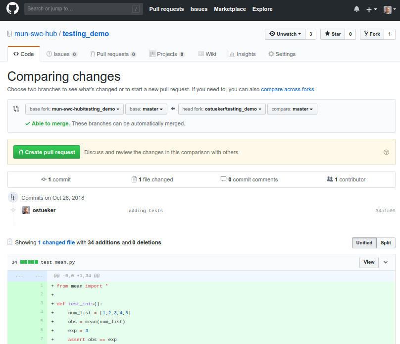

Pull-Requests are a method of merging commits between repositories that have
been forked. GitLab calls them "Merge-Requests" but they are exactly the same
thing.  We will continue to call them "Pull-Requests" in these lessons.
Often they are abbreviated as _PR_.

You can fork any repository that you have at least read-access to, start
implementing an enhancement, fixing bugs or typos, improving documentation,
etc.  When you feel you are done with your improvement, you open a pull-request.

Like _Issues_ each pull-request gets a unique ID, a title and an initial
comment. Conversations are possible by posing additional comments.
In addition to that, all commits that have been made to the forked repository
that are not already in the origin repository will be attached to the pull-request.

The owner of the original repository (or any developer who has been granted
sufficient rights by the owner) can **merge** the commits of the pull-request
into the original repository from the website and thereby close the pull-request.

> ## Submit a Pull Request
>
> 1. Go to your forked repository on the website.
> 2. Clone it to your Desktop using `git clone ...` in the Unix Shell:
>    ~~~
>    $ git clone https://github.com/<Your_GitHub_Username>/testing_demo.git
>    $ cd testing_demo
>    $ ls
>    ~~~
>    {: .language-bash}
>    ~~~
>    more_files  mean.py  README.md  Workflow.md
>    ~~~
>    {: ..output-bash}
> 3. Download the file `test_mean.py` and copy it into the cloned repo
>    (Into the same folder that contains `README.md` and `mean.py`).
> 4. Add the file `test_mean.py`, make a commit and push to GitHub:
>    ~~~
>    $ cp more_files/test_mean.py  ./
>    $ git add test_mean.py
>    $ git commit -m "adding unit tests"
>    $ git push origin master
>    ~~~
>    {: .language-bash}
> 5. Go back to the GitHub website and open a pull-request (button: [New Pull Request]).
>
{: .challenge}

> ## Choose the right branches!
> When creating a pull-request you have to choose the correct repositories:
> 1. **base-fork** - the repository **to** which the changes should be merged.
> 2. **head-fork** - the repository **from** which the changes should be merged.
> Some repositories have multiple branches (lines of development.) Make sure you
> select the right ones.
>
> **Look at the list of commits as well as the changes (diffs) below to
> make sure your settings are correct.**
{: .callout}

> ## Make sure your Pull Request can be merged.
>
> When opening a new pull-request you will wither see:
> "&#x2713; Able to merge" or:
> "&#x2718; Can't automatically merge".  
>
> The second can happen when commits have been made (or merged) to the original
> repository since it has been forked.
>
> In this case:
> 1. merge the current state of the original repository into the fork,
> 2. resolve the merge conflicts
> 3. test that your contribution still works as expected
> 4. now open the pull-request.
{: .callout}

> ## Contribution Guidelines
>
> If you are trying to contribute changes to a project, first look if there
> is a Contribution Guide.  It is often a document called `CONTRIBUTING`,
> `CONTRIBUTING.md` or similar and is located in a repository's root, docs,
> or .github directory.
>
> In such a guide the project's maintainers can describe a procedure how
> they like to receive contributions and things that they pay special attention
> to, for example:
> * code must follow a certain coding style
> * code must have proper documentation
> * code must have associated unit tests
> * all tests must pass
> * pull-requests must be made against a certain branch
>
> But it often also contains things like:
> * Links to external documentation, mailing lists, or a code of conduct.
> * Community and behavioral expectations.
>
> Please be polite and follow the Contribution Guide.  Most likely your
> pull-request won't be accepted until it follows the guide anyway.
> Therefore you might as well follow the steps right away.
>
> If your own project accepts contributions from other developers,
> consider creating a  `CONTRIBUTING` of your own.
{: .callout}
